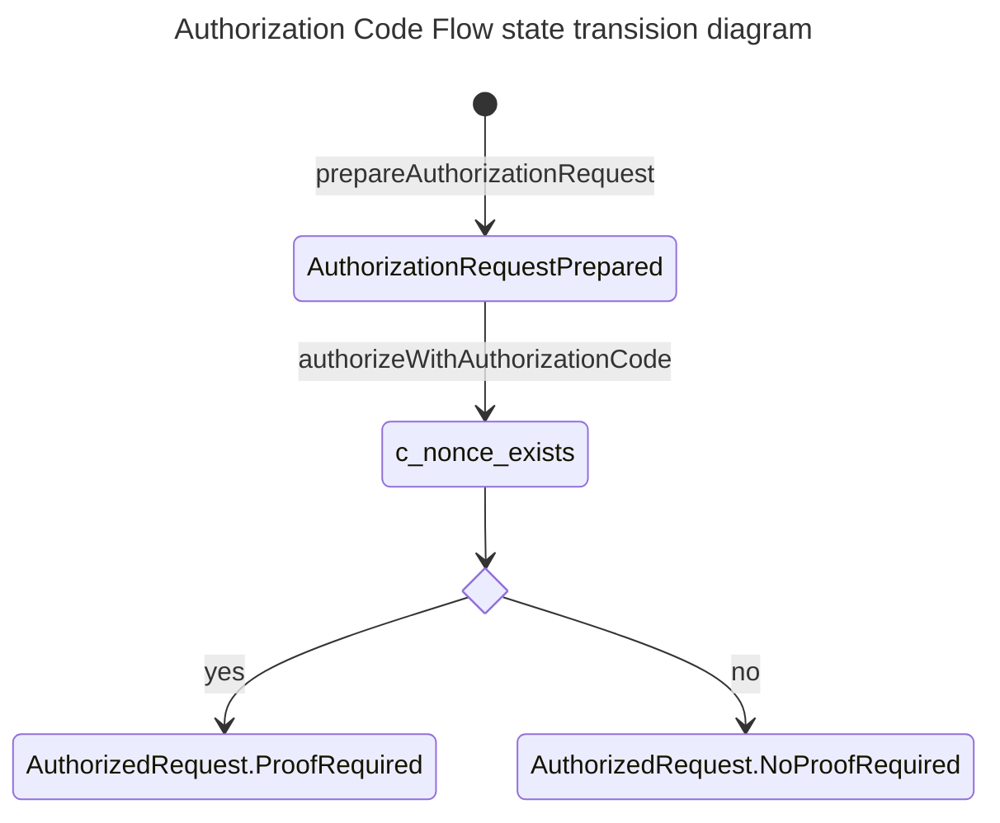
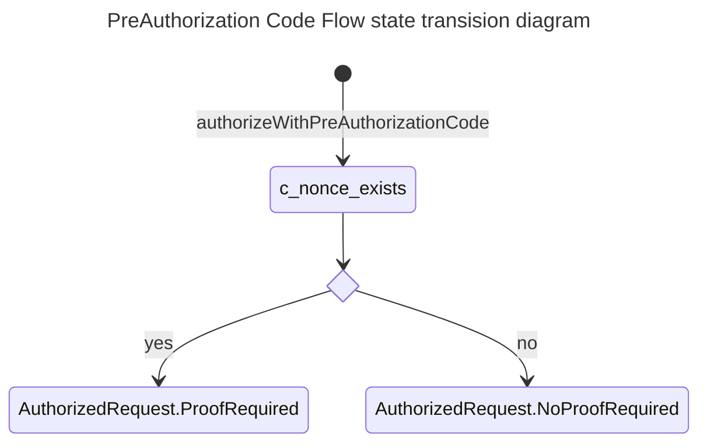

# EUDI OpenId4VCI library

:heavy_exclamation_mark: **Important!** Before you proceed, please read
the [EUDI Wallet Reference Implementation project description](https://github.com/eu-digital-identity-wallet/.github/blob/main/profile/reference-implementation.md)

[](https://www.apache.org/licenses/LICENSE-2.0)

## Table of contents

* [Overview](#overview)
* [Disclaimer](#disclaimer)
* [Use cases supported](#use-cases-supported)
* [Configuration options](#configuration-options)
* [Other features](#other-features)
* [Features not supported](#features-not-supported)
* [How to contribute](#how-to-contribute)
* [License](#license)


## Overview

This is a Kotlin library, targeting JVM, that supports
the [OpenId4VCI (draft 13)](https://openid.net/specs/openid-4-verifiable-credential-issuance-1_0-13.html) protocol.

In particular, the library focuses on the wallet's role in and provides the following features:


| Feature                                                                                       | Coverage                                                                                                               |
|-----------------------------------------------------------------------------------------------|------------------------------------------------------------------------------------------------------------------------|
| [Wallet-initiated issuance](#wallet-initiated-issuance)                                                                 | ✅                                                                                                                        |
| [Resolve a credential offer](#resolve-a-credential-offer)                                     | ✅ Unsigned metadata ❌ [accept-language](#issuer-metadata-accept-language) ❌ [signed metadata](#issuer-signed-metadata) |
| [Authorization code flow](#authorization-code-flow)                                           | ✅                                                                                                                      |
| [Pre-authorized code flow](#pre-authorized-code-flow)                                         | ✅                                                                                                                      |
| mso_mdoc format                                                                               | ✅                                                                                                                      |
| SD-JWT-VC format                                                                              | ✅                                                                                                                      |
| W3C VC DM                                                                                     | VC Signed as a JWT, Not Using JSON-LD                                                                                  |
| [Place credential request](#place-credential-request)                                         | ✅ Including automatic handling of `invalid_proof`                                                                      |
| [Place batch credential request](#place-batch-credential-request)                             | ✅                                                                                                                      | 
| [Query for deferred credential](#query-for-deferred-credential)                               | ✅ Including automatic refresh of `access_token`                                                                        |
| [Query for deferred credential at a later time](#query-for-deferred-credential-at-later-time) | ✅ Including automatic refresh of `access_token`                                                                        |
| [Notify credential issuer](#notify-credential-issuer)                                         | ✅                                                                                                                      | 
| Proof                                                                                         | ✅ JWT ✅ CWT                                                                                                            |
| Credential response encryption                                                                | ✅                                                                                                                      |
| [Pushed authorization requests](#pushed-authorization-requests)                               | ✅ Used by default, if supported by issuer                                                                              |
| [Demonstrating Proof of Possession (DPoP)](#demonstrating-proof-of-possession-dpop)           | ✅                                                                                                                      |
| [PKCE](#proof-key-for-code-exchange-by-oauth-public-clients-pkce)                             | ✅                                                                                                                      |
| Wallet authentication                                                                         | currently, only public client                                                                                          |


## Disclaimer

The released software is an initial development release version:
-  The initial development release is an early endeavor reflecting the efforts of a short timeboxed period, and by no means can be considered as the final product.
-  The initial development release may be changed substantially over time, might introduce new features but also may change or remove existing ones, potentially breaking compatibility with your existing code.
-  The initial development release is limited in functional scope.
-  The initial development release may contain errors or design flaws and other problems that could cause system or other failures and data loss.
-  The initial development release has reduced security, privacy, availability, and reliability standards relative to future releases. This could make the software slower, less reliable, or more vulnerable to attacks than mature software.
-  The initial development release is not yet comprehensively documented.
-  Users of the software must perform sufficient engineering and additional testing in order to properly evaluate their application and determine whether any of the open-sourced components is suitable for use in that application.
-  We strongly recommend to not put this version of the software into production use.
-  Only the latest version of the software will be supported

## Use cases supported

### Wallet-initiated issuance

As a wallet/caller having an out-of-band knowledge of a credential issuer,
use the library to initiate issuance:

- Fetch and validate the Credential Issuer Metadata
- Fetch and validate the OAUTH2 or OIDC metadata used by the Credential Issuer
- Ensure that out-of-band knowledge is valid

This is equivalent as [resolving a credential offer](#resolve-a-credential-offer), having authorization code grant, without issuer state.

#### Wallet-initiated issuance preconditions

- The wallet knows the credential issuer id
- The wallet knows one or more credential configuration ids 
- The wallet has prepared an issuance [configuration](#configuration-options), describing the capabilities & policies of the wallet.

#### Wallet-initiated issuance successful outcome

Same as [outcome](#resolve-a-credential-offer-successful-outcome), as if a 
equivalent offer was resolved.

#### Wallet-initiated issuance steps

1. Wallet/caller using the library to instantiate an [Issuer](src/main/kotlin/eu/europa/ec/eudi/openid4vci/Issuer.kt)
2. If checks pass, an `Issuer` will be returned to the caller.

#### Wallet-initiated issuance execution 

```kotlin
import eu.europa.ec.eudi.openid4vci.*

val openId4VCIConfig = ...
val credentialIssuerId: CredentialIssuerId = //known 
val credentialConfigurationIds: List<CredentialConfigurationIdentifier> = // known

val issuer = 
    Issuer.makeWalletInitiated(
        config,
        credentialIssuerId,
        credentialConfigurationIds
    ).getOrThrow()
```
#### Wallet-initiated issuance next steps

- [Authorize wallet for issuance](#authorize-wallet-for-issuance) 

### Resolve a credential offer

As a wallet/caller use the library to process a URI that represents a credential offer 
- to make sure that it is a valid offer, 
- comes from an issuer which advertises properly its metadata and that
- this offer is compatible with wallet configuration.

#### Resolve a credential offer preconditions

- The wallet has obtained this URI. Typically, either scanning a QR Code or in response to a custom URI.
- The wallet has prepared an issuance [configuration](#configuration-options), describing the capabilities & policies of the wallet.

This resolution includes the following

- Check and validate the structure of the URI
- Fetch the actual contents of the offer, in case URI points by reference to the offer
- Fetch and validate the Credential Issuer Metadata
- Fetch and validate the OAUTH2 or OIDC metadata used by the Credential Issuer
- Ensure that credential offer is aligned to both the above metadata & wallet issuance configuration

#### Resolve a credential offer successful outcome:

An instance of the [Issuer](src/main/kotlin/eu/europa/ec/eudi/openid4vci/Issuer.kt)  interface (the main entry point to the library) will have been initiated.
This instance, includes the resolved [CredentialOffer](src/main/kotlin/eu/europa/ec/eudi/openid4vci/CredentialOfferRequestResolver.kt) and the necessary methods to proceed
The resolved  offer contains the mandatory elements required for issuance.
- The issuer's identifier
- The selected authorization server that will authorize the issuance
- The specific credentials that will be requested

These elements  can be used to populate a wallet view that 
asks user's consensus to proceed with the issuance. This includes  the authorization
flow to be used (either authorization code flow, or pre-authorized code)

This concern, though is out of the scope of library

#### Resolve a credential offer execution

In order to resolve a credential offer wallet/caller must provide [configuration options](#configuration-options)

```kotlin
import eu.europa.ec.eudi.openid4vci.*

val openId4VCIConfig = ...
val credentialOfferUri: String = "..."
val issuer = Issuer.make(openId4VCIConfig, credentialOfferUri).getOrThrow()
```

#### Resolve a credential offer next steps

- [Authorize wallet for issuance](#authorize-wallet-for-issuance)

### Authorize wallet for issuance

As a wallet/caller use the library to obtain an `access_token`, to be able to access 
the credential issuer's protected endpoints

#### Authorize wallet for issuance preconditions

- A credential offer has been [resolved](#resolve-a-credential-offer), and as a result
- An instance of the `Issuer` interface has been instantiated

There are three distinct cases, depending on the content of the credential offer

- [Use authorization code flow](#authorization-code-flow)
- [Use pre-authorized code flow](#pre-authorized-code-flow)
- A credential offer supporting both flows. In this case, the caller/wallet must select which 
flow to use. This decision is out of the scope of the library, although pre-authorized code flow
perhaps is more convenient since it includes fewer steps. 

#### Authorize wallet for issuance successful outcome:

At the end of the use case, wallet will have an `AuthorizedRequest` instance.

Depending on the capabilities of the token endpoint of the credential issuer this `AuthorizedRequest` will be either 
- `ProofRequired` : That's the case where Token Endpoint provided a `c_nonce` attribute
- `NoProofRequired` : Otherwise.

`AuthorizedRequest` will contain the `access_token` (bearer or [DPoP](#demonstrating-proof-of-possession-dpop)), and, if provided,
the `refresh_token` and `c_nonce`

#### Authorize wallet for issuance next steps

- [Place credential request](#place-credential-request), or
- [Place batch credential request](#place-batch-credential-request)

### Authorization code flow



#### Authorization code flow preconditions

In addition to the [common authorization preconditions](#authorize-wallet-for-issuance-preconditions)

- The credential offer specifies authorization code flow, or
- Wallet/Caller decides to use this flow

#### Authorization code flow steps

1. Wallet/caller using asks the `Issuer` instance to prepare a URL where the mobile device browser needs to be pointed to.
Library prepares this URL as follows
   - If [PAR](#pushed-authorization-requests) endpoint is advertised it will place a PAR request and assemble the URL for the authorization endpoint
   - If PAR endpoint is not supported (or disabled), it will assemble the URL, as normally, for the authorization endpoint
   - In both case [PKCE](#proof-key-for-code-exchange-by-oauth-public-clients-pkce) will be used
2. Wallet/Caller opens the mobile's browser to the URL calculated in the previous step
3. User interacts with the authorization server via mobile device agent, typically providing his authorization
4. On success, authorization redirects to a wallet provided `redirect_uri`, providing the `code` and a `state` parameters
5. Using the `Issuer` instance exchange the `authorization code` for an `access_token` 

In the scope of the library are steps 1 and 5.

#### Authorization code flow execution

```kotlin
import eu.europa.ec.eudi.openid4vci.*

// Step 1
val preparedAuthorizationRequest = 
    with(issuer) {
        prepareAuthorizationRequest().getOrThrow()
    }
// Step 2
// Wallet opens mobile's browser and points it to 

// Step 4
// Wallet has extracted from authorization redirect_uri
// the code and state parameters
val (authorizationCode, state) = ... // using url preparedAuthorizationRequest.authorizationCodeURL authenticate via front-channel on authorization server and retrieve authorization code 

// Step 5
val authorizedRequest =
     with(issuer) {
         with(preparedAuthorizationRequest) {
             authorizeWithAuthorizationCode(AuthorizationCode(authorizationCode),state).getOrThrow()
         }
     }
```

### Pre-authorized code flow



#### Pre-authorized code flow preconditions

In addition to the [common authorization preconditions](#authorize-wallet-for-issuance-preconditions)

- The credential offer specifies pre-authorized code flow or 
- Wallet/caller decided to use this flow
- Optionally, wallet has received via another channel a `tx_code`  
- Wallet has gathered from the user this `tx_code` value, if needed
 
Steps:
1. Using the `Issuer` instance exchange the pre-authorized code & optionally the `tx_code` with an `access_token`
2. Library will place an adequate request the token endpoint of the credential issuer
3. Library will receive token endpoint response and map it to a `AuthorizedRequest`


#### Pre-authorized code flow execution

```kotlin
import eu.europa.ec.eudi.openid4vci.*

val txCode : Sting? = ... // Pin retrieved from another channel, if needed

val authorizedRequest =  
    with(issuer) {
         authorizeWithPreAuthorizationCode(txCode).getOrThrow()
    }
```

### Place credential request

Wallet/caller wants to place a request against the credential issuer, for one of 
the credential configurations that were present in the offer, or alternatively for 
a specific credential identifier in case token endpoint provided an `authorization_details`.

#### Place credential request preconditions

- An instance of the `Issuer` interface has been instantiated
- [Wallet authorization](#authorize-wallet-for-issuance) has been performed and as a result
- An instance of `AuthorizedRequest` is available
- Wallet/Caller has decided for which `credential_configuration_id` - found in the offer - the request will be placed for
- Wallet/Caller has decided which `credential_identifier` - optional attribute found in the `AuthorizedRequest` - the request will be placed for
- Wallet/Caller has decided if a subset of the claims will be requested or all.
- Wallet/Caller is ready to provide a suitable Proof signer for JWT or CWT proofs, if applicable

#### Place credential request steps

1. Wallet/caller using the library assemble the request providing a `credential_configuration_id` and optionally a `credential_identifier`
2. Wallet/caller using the `Issuer` and `AuthorizedRequest` place the request 
3. Library places the appropriate request against the Credential Endpoint of the Credential Issuer
4. Library receives the Credential Issuer response and maps it to a `SubmissionOutcome`
5. Wallet/caller gets back the `SubmissionOutcome` for further processing
6. Wallet/caller may have to introspect the outcome to assemble a fresh `AuthorizedRequest` carrying possibly a fresh `c_nonce` 

#### Place credential request outcome

The result of placing a request is represented by a `SubmissionOutcome` as follows:

- `SubmissionOutcome.Sucess` This could represent either the issued credential or a transaction_id in case
of deferred issuance, or
- `SubmissionOutcome.InvalidProof` indicating that credential issuer requires PoP or PoP provided was not valid
- `SubmissionOutcome.Failed` indication that credential issuer rejected the request, or 

In case of an unexpected error a runtime will be raised.

#### Place credential request execution

```kotlin
import eu.europa.ec.eudi.openid4vci.*

val popSigner: PopSigner? = // optional JWT or CWT signer. Required only if proof are required by issuer
val claimSetToRequest : ClaimSet? = null // null indicates that all claims will be requested    

// Step 1
// Assemble the request    
val request = 
    IssuanceRequestPayload.ConfigurationBased(credentialConfigurationId, claimSetToRequest)

// Place the request
val (updatedAuthorizedRequest, outcome) =
    with(issuer) {
        with(authorizedRequest) {
            requestSingleAndUpdateState(request, popSigner)
        }
    }

```

**Important note**

The ability of the token endpoint of the credential issuer to provide a `c_nonce` is an
optional feature specified in the OpenId4VCI specification. Possibly, it will be removed.

According to the specification, the wallet must be able to receive a 
`c_nonce` primarily via the credential issuance response, which is represented by `SubmissionOutcome`
in the library.

For this reason, it is not uncommon that the first request to the credential issuance endpoint
will have as an outcome `InvalidProof`. That's typical if credential issuer's token endpoint
doesn't provide a `c_nonce` and proof is required for the requested credential.

The library will automatically try to handle the invalid proof response and place a second request 
which includes proofs. This can be done only if caller has provided a `popSigner` while 
invoking `requestSingleAndUpdateState()`. In case, that this second request fails with `invalid_proof` 
library will not retry the request and an error will be reported to caller.

#### Place credential request next steps

- Validate credential and store it. That's out of library scope, or
- [Query for credential](#query-for-deferred-credential), or
- [Query for credential at later time](#query-for-deferred-credential-at-later-time), or
- [Notify credential issuer](#notify-credential-issuer)

### Query for deferred credential

Wallet/caller wants to query credential issuer for a deferred credential, while still holding
an `AuthorizedRequest` and an `Issuer` instance.

#### Query for deferred credential preconditions

- Wallet/caller has [placed a credential request](#place-a-credential-request)
- Wallet/caller has received an [outcome](#place-credential-request-outcome) carrying a `transaction_id`
- Wallet/caller has an instance of `AuthorizedRequest` 

#### Query for deferred credential steps

1. Wallet/caller issuing the `Issuer` instance places the query providing `AuthorizedRequest` and `transaction_id`
2. Library checks if `access_token`  in `AuthorizedRequest` is expired
3. If `access_token` is expired it will automatically be refreshed, provided that credential issuer has given a `refresh_token`
4. Library places the query against the Deferred Endpoint of the credential issuer
5. Library gets credential issuer response and maps it into `DeferredCredentialQueryOutcome`
6. Caller gets back an `AuthorizedRequest` and `DeferredCredentialQueryOutcome`

#### Query for deferred credential outcome

The outcome of placing this query is a pair comprised of  

- `AuthorizedRequest` : This represents a possibly updated `AuthorizedRequest` with a refreshed `access_token`
- `DeferredCredentialQueryOutcome`: This is the response of the deferred endpoint and it could be one of
  - `Issued` : Deferred credential was issued 
  - `IssuancePending`: Deferred credential was not ready
  - `Errored`: Credential issuer doesn't recognize the `transaction_id`

#### Query for deferred credential execution

```kotlin
val authorizedRequest = // has been retrieved in a previous step
val deferredCredential = // has been retrieved in a previous step. Holds the transaction_id

val (updatedAuthorizedRequest, outcome) =  
    with(issuer) {
        with(authorizedRequest) {
            queryForDeferredCredential(deferredCredential).getOrThrow()
        }
    }    

```
#### Query for deferred credential next steps

- Validate credential and store it. That's out of library scope, or
- [Query for credential](#query-for-deferred-credential)

### Query for deferred credential at later time

Wallet/caller wants to suspend issuance process, store its context and query issuer at a later time.
There are limitations for this use case

- The lifecycle of `transaction_id` is bound to the expiration of the `access_token`.
- The `access_token` can be refreshed - library transparently does this - only if credential issuer has provided a `refresh_token`

This means that wallet/caller can query for a deferred credential as long as it has a non-expired
`access_token` or `refresh_token`.

### Query for deferred credential at later time preconditions

As per [query for deferred credential](#query-for-deferred-credential-preconditions)

#### Query for deferred credential at a later time steps

1. Wallet/caller using the `Issuer` instance obtains a `DeferredIssuanceContext`. That's a minimum set of data (configuration options and state) that are needed to query again the credential issuer
2. Wallet/caller stores the `DeferredIssuanceContext`. How this is done is outside the scope of the library
3. Wallet/caller loads the `DeferredIssuanceContext`. That's also outside the scope of the library
4. Wallet/caller queries the credential issuer issuing `DeferredIssuer`
5. Library performs all steps defined in [Query for deferred credential](#query-for-deferred-credential)
6. Library returns to the caller the `DeferredIssuanceContxt?` and the `DeferredCredentialQueryOutcome`
7. Depending on the outcome, wallet/caller may choose to store the new `DeferredIssuanceContxt` to query again, later on

#### Query for deferred credential at later time outcome

The outcome of placing this query is a pair comprised of
- `DeferredIssuanceContext` : This represents a possibly new state of authorization carrying a refreshed `access_token`
- `DeferredCredentialQueryOutcome`: This is the response of the deferred endpoint and it could be one of
    - `Issued` : Deferred credential was issued
    - `IssuancePending`: Deferred credential was not ready
    - `Errored`: Credential issuer doesn't recognize the `transaction_id`

#### Query for deferred credential at later time execution

```kotlin

val authorizedRequest = // has been retrieved in a previous step
val deferredCredential = // has been retrieved in a previous step. Holds the transaction_id
    
// Step 1
val deferredCtx = 
    with(issuer) {
        with(authorizedRequest) {
            deferredContext(deferredCredential).getOrThrough()    
        }
    }

// Store context

// Load context

// Step 4
val (updatedDeferredCtx, outcome) = 
    DeferredIssuer.queryForDeferredCredential(deferredCtx).getOrThrough()
```
#### Serializing `DeferredIssuanceContext`

How waller/caller stores and loads the `DeferredIssuanceContext` is out of scope
of the library. 

There is though an [indicative implementation](src/test/kotlin/eu/europa/ec/eudi/openid4vci/examples/DeferredIssuerExtensions.kt) 
that serializes the context as a JSON object.


### Notify Credential Issuer

Wallet/caller wants to notify the credential issuer, about the overall 
outcome of the issuance, using one of the defined notifications:

- Accepted : Credential was successfully stored in the Wallet
- Deleted: Unsuccessful Credential issuance was caused by a user action.
- Failed:  Other unsuccessful cases

#### Notify Credential Issuer preconditions

- Credential issuer advertises the optional Notification Endpoint
- Wallet/caller has received a [IssuedCredential.Issued](src/main/kotlin/eu/europa/ec/eudi/openid4vci/Issuance.kt) with a `notificationId`  
  (via credential, deferred or batch endpoint)  
- Wallet/caller has processed the issued credential (verification & storage)
- Wallet/caller still has a reference to the `Issuer` and `AuthorizedRequest` instances

#### Notify Credential Issuer outcome

The use case always succeeds, even in the case of an unexpected error.

#### Notify Credential Issuer steps

1. Wallet/caller using the library creates a notification event
2. Wallet/caller using the `Issuer` instance places the notification to the credential issuer

#### Notify Credential Issuer execution

```kotlin
val authorizedRequest = // has been retrieved in a previous step
val notificationId = // has been provided by the issuer

// Step 1
// Other events are Deleted and Failed    
val event = 
    CredentialIssuanceEvent.Accepted(notificationId, "Got it!")

// Step 2
with(issuer){
    with(authorizedRequest){
        notify(event).getOrNull()
    }
}
```

## Configuration Options

The options available for the `Issuer` are represented by `OpenId4VCIConfig`

```kotlin
data class OpenId4VCIConfig(
    val clientId: ClientId,
    val authFlowRedirectionURI: URI,
    val keyGenerationConfig: KeyGenerationConfig,
    val credentialResponseEncryptionPolicy: CredentialResponseEncryptionPolicy,
    val authorizeIssuanceConfig: AuthorizeIssuanceConfig = AuthorizeIssuanceConfig.FAVOR_SCOPES,
    val dPoPSigner: PopSigner.Jwt? = null,
    val parUsage: ParUsage = ParUsage.IfSupported,
    val clock: Clock = Clock.systemDefaultZone(),
)
```

Options available:

- clientId: Wallet `client_id` in the OAUTH2 sense while interacting with the Credential Issuer
- authFlowRedirectionURI: It is the `redirect_uri` parameter that will be included in a PAR or simple authorization request.
- keyGenerationConfig: A way of generating ephemeral keys used for `credential_response_encryption`
- credentialResponseEncryptionPolicy: A wallet policy in regard to whether it accepts credentials without `credential_response_encyrption` or not
- authorizeIssuanceConfig: Preference on using `scope` or `authorization_details` during authorization code flow
- dPoPSigner: An optional way of singing DPoP JWTs. If not provided DPoP is off. If provided it will be used only if Credential Issuer advertises this feature
- parUsage: An indication to not use PAR endpoint or use it if advertised by the credential issuer
- clock: Wallet/Caller clock.

```kotlin
import eu.europa.ec.eudi.openid4vci.*

val openId4VCIConfig = OpenId4VCIConfig(
    clientId = "wallet-dev", // the client id of wallet (acting as an OAUTH2 client)
    authFlowRedirectionURI = URI.create("eudi-wallet//auth"), // where the Credential Issuer should redirect after Authorization code flow succeeds
    keyGenerationConfig = KeyGenerationConfig.ecOnly(Curve.P_256), // what kind of ephemeral keys could be generated to encrypt credential issuance response
    credentialResponseEncryptionPolicy = CredentialResponseEncryptionPolicy.SUPPORTED, // policy concerning the wallet's requirements for encryption of credential responses
)
val credentialOfferUri: String = "..." 
val issuer = Issuer.make(openId4VCIConfig, credentialOfferUri).getOrThrow()
```

## Other features

### Pushed authorization requests

Library supports [RFC 9126 OAuth 2.0 Pushed Authorization Requests](https://www.rfc-editor.org/rfc/rfc9126)
To use the PAR endpoint 
- wallet [configuration](#configuration-options) shouldn't exclude its use (explicit configuration option) and 
- PAR should be advertised by credential issuer's metadata

Library will automatically use the PAR endpoint during the [authorization code flow](#authorization-code-flow), 
otherwise it will fall back to a regular authorization request.

### Place batch credential request

Library supports placing request against the Batch Endpoint of the Credential Issuer.
This functionality probably will be removed from library given that OpenId4VCI will remove it, as well.

### Proof Types Supported

The current version of the library supports JWT and CWT proofs

### Demonstrating Proof of Possession (DPoP)

Library supports [RFC9449](https://datatracker.ietf.org/doc/html/rfc9449). In addition to
bearer authentication scheme, library can be configured to use DPoP authentication provided
that the authorization server, that protects the credential issuer, supports this feature as well.

If wallet [configuration](#configuration-options) provides a DPoP Signer and if the credential issuer advertises DPoP with
algorithms supported by wallet's DPoP Signer, then library will transparently request
for a DPoP `access_token` instead of the default Bearer token.

Furthermore, all subsequent interactions will use the correct token type (Bearer or DPoP)

###  Proof Key for Code Exchange by OAuth Public Clients (PKCE)

Library supports [RFC7636](https://www.rfc-editor.org/rfc/rfc7636.html) by default 
while performing [Authorization code flow](#authorization-code-flow). 
This feature cannot be disabled.

## Features not supported

### Issuer metadata accept-language

In [section 11.2.2](https://openid.net/specs/openid-4-verifiable-credential-issuance-1_0-13.html#section-11.2.2) specification recommends the use of header `Accept-Language` to indicate the language(s) preferred for display.
Current version of the library does not support this.

### Issuer signed metadata

In [section 11.2.3](https://openid.net/specs/openid-4-verifiable-credential-issuance-1_0-13.html#section-11.2.3) specification details the metadata an issuer advertises through its metadata endpoint.
Current version of the library supports all metadata specified there except `signed_metadata` attribute.

### Authorization

Specification defines ([section 5.1.1](https://openid.net/specs/openid-4-verifiable-credential-issuance-1_0-13.html#section-5.1.1)) that a credential's issuance
can be requested using `authorization_details` or `scope` parameter when using authorization code flow. The current version of the library supports usage of both parameters.
Though for `authorization_details` we don't yet support the `format` attribute and its specializations per profile as specified in [Appendix A](https://openid.net/specs/openid-4-verifiable-credential-issuance-1_0-13.html#appendix-A).
Only `credential_configuration_id` attribute is supported.

The same stands for the **token endpoint** when (as specified in [section 6.2](https://openid.net/specs/openid-4-verifiable-credential-issuance-1_0-13.html#section-6.2)) server response includes
`authorization_details`. In this case too, the library does not support authorization details that include `format` attribute.

## How to contribute

We welcome contributions to this project. To ensure that the process is smooth for everyone
involved, follow the guidelines found in [CONTRIBUTING.md](CONTRIBUTING.md).

## License

### Third-party component licenses

* OAUTH2 & OIDC Support: [Nimbus OAuth 2.0 SDK with OpenID Connect extensions](https://connect2id.com/products/nimbus-oauth-openid-connect-sdk)
* URI parsing: [Uri KMP](https://github.com/eygraber/uri-kmp)
* Http Client: [Ktor](https://ktor.io/)
* Json: [Kotlinx Serialization](https://github.com/Kotlin/kotlinx.serialization)
* CBOR: [Authlete CBOR](https://github.com/authlete/cbor)

### License details

Copyright (c) 2023 European Commission

Licensed under the Apache License, Version 2.0 (the "License");
you may not use this file except in compliance with the License.
You may obtain a copy of the License at

    http://www.apache.org/licenses/LICENSE-2.0

Unless required by applicable law or agreed to in writing, software
distributed under the License is distributed on an "AS IS" BASIS,
WITHOUT WARRANTIES OR CONDITIONS OF ANY KIND, either express or implied.
See the License for the specific language governing permissions and
limitations under the License.
