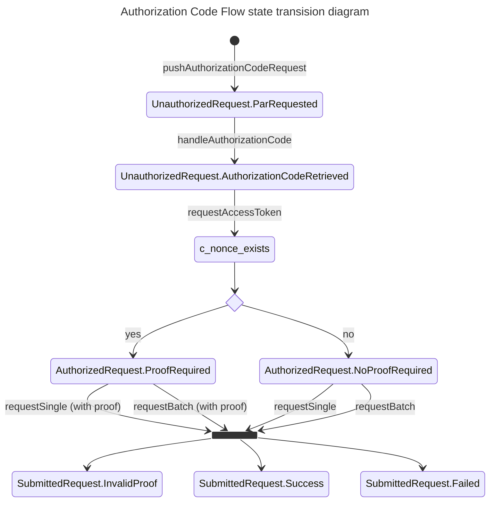
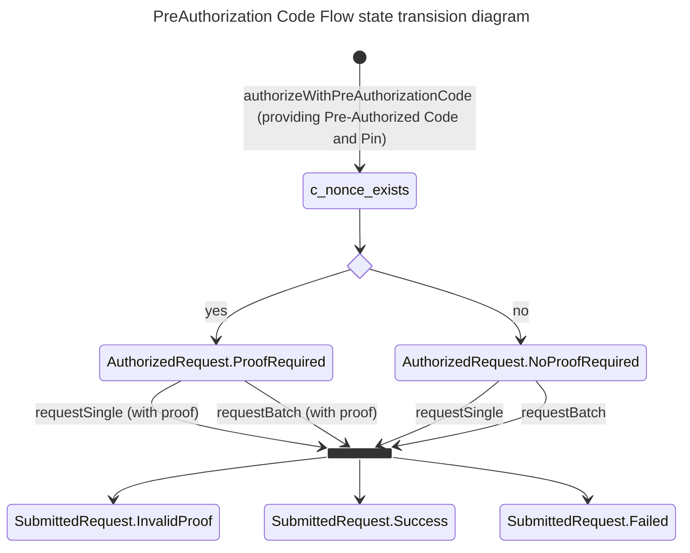

# EUDI OpenId4VCI library

[](https://www.apache.org/licenses/LICENSE-2.0)

## Table of contents

* [Overview](#overview)
* [Disclaimer](#disclaimer)
* [How to use](#how-to-use)  
* [OpenId4VCI features supported](#openid4vci-features-supported)
* [How to contribute](#how-to-contribute)
* [License](#license)


## Overview

This is a Kotlin library, targeting JVM, that supports 
the [OpenId4VCI (draft 12)](https://openid.bitbucket.io/connect/openid-4-verifiable-credential-issuance-1_0.html) protocol.
In particular, the library focuses on the wallet's role in the protocol to:
- Resolve credential issuer metadata 
- Resolve metadata of the authorization server protecting issuance services
- Resolve a credential offer presented by an issuer service
- Negotiate authorization of a credential issuance request
- Submit a credential issuance request


## Disclaimer

The released software is an initial development release version: 
-  The initial development release is an early endeavor reflecting the efforts of a short timeboxed period, and by no means can be considered as the final product.  
-  The initial development release may be changed substantially over time, might introduce new features but also may change or remove existing ones, potentially breaking compatibility with your existing code.
-  The initial development release is limited in functional scope.
-  The initial development release may contain errors or design flaws and other problems that could cause system or other failures and data loss.
-  The initial development release has reduced security, privacy, availability, and reliability standards relative to future releases. This could make the software slower, less reliable, or more vulnerable to attacks than mature software.
-  The initial development release is not yet comprehensively documented. 
-  Users of the software must perform sufficient engineering and additional testing in order to properly evaluate their application and determine whether any of the open-sourced components is suitable for use in that application.
-  We strongly recommend to not put this version of the software into production use.
-  Only the latest version of the software will be supported

## How to use

Library provides the following main api elements to facilitate consumers of this api with the operations related to verifiable credentials issuance  

- **Metadata resolvers**: Components that interact with credential issuer and its authorization server to obtain and parse their metadata.  
- **Credential offer resolver**: A component that interacts with credential issuer to resolve and validate a credential offer presented by the issuer.  
- **Issuer component**: A component that offers all operation required to authorize and submit a credential issuance request.

### Resolve Credential Issuer and authorization server metadata

To obtain the credential issuers metadata use [CredentialIssuerMetadataResolver](src/main/kotlin/eu/europa/ec/eudi/openid4vci/CredentialIssuerMetadataResolver.kt) the following way

```kotlin
import eu.europa.ec.eudi.openid4vci.*

val credentialIssuerIdentifier = CredentialIssuerId("https://....").getOrThrow() // credential issuer id is a https url with no query or fragment components
val resolver = CredentialIssuerMetadataResolver() // get a default implementation of the CredentialIssuerMetadataResolver interface 
val metadata: CredentialIssuerMetadata = resolver.resolve(credentialIssuerIdentifier).getOrThrow()  // fetch and parse credential issuer metadata
```
In case of metadata parsing failure a `Result.failure()` will be returned to caller wrapping the exception thrown while parsing metadata.


To obtain the authorization server's  metadata use [AuthorizationServerMetadataResolver](src/main/kotlin/eu/europa/ec/eudi/openid4vci/AuthorizationServerMetadataResolver.kt) the following way
```kotlin
import eu.europa.ec.eudi.openid4vci.*

val resolver = AuthorizationServerMetadataResolver() // get a default implementation of the AuthorizationServerMetadataResolver interface
val metadata: CIAuthorizationServerMetadata = resolver.resolve(HttpsUrl("https://...")).getOrThrow() // fetch and parse authorization server metadata
```

### Resolve a credential offer presented by issuer

A CredentialOfferRequestResolver uses internally the two metadata resolvers mentioned above to resolve metadata of issuer and its authorization server

Given a credential offer url use [CredentialOfferRequestResolver](src/main/kotlin/eu/europa/ec/eudi/openid4vci/CredentialOfferRequestResolver.kt) the following way to validate and resolve it to [CredentialOffer](src/main/kotlin/eu/europa/ec/eudi/openid4vci/CredentialOfferRequestResolver.kt)

```kotlin
import eu.europa.ec.eudi.openid4vci.*

val credentialOfferRequestResolver = CredentialOfferRequestResolver()
val credentialOffer: CredentialOffer = credentialOfferRequestResolver.resolve(coUrl).getOrThrow()
```

### Credential Issuance

The process of requesting an issuance has been implemented as a stateful process whose steps are depicted as dedicated states holding the outcome of each step. 
Depending on the state of the process, specific transitions are allowed to move the process to the next step. 

VCI specification defines two flows of issuance;
- Authorization Code Flow (wallet-initiated flow)
- Pre-Authorization Code Flow. In this flow, before initiating the flow with the Wallet, the Credential Issuer first conducts the steps required to prepare the Credential issuance.

The following state diagrams sketch each flow's states and their allowed transitions. 





[Issuer](src/main/kotlin/eu/europa/ec/eudi/openid4vci/Issuer.kt) the following way to validate and resolve it to [CredentialOffer](src/main/kotlin/eu/europa/ec/eudi/openid4vci/CredentialOfferRequestResolver.kt) component is the component that facilitates the authorization and submission of a credential issuance request (batch or single)
As depicted from the below diagram it is consisted of two sub-components:
- **IssuanceAuthorizer**: A component responsible for all interactions with an authorization server to authorize a request for credential(s) issuance.
- **IssuerRequester**: A component responsible for all interactions with credential issuer for submitting credential issuance requests.

#### Initialize an Issuer

The Issuer interface provides a factory method to construct an issuer component. 

```kotlin
import eu.europa.ec.eudi.openid4vci.*

val issuer =  
    Issuer.make(
        authorizationServerMetadata, // authorization server metadata.
        issuerMetadata, // credential issuer's metadata
        openId4VCIConfig, // configuration attributes    
        responseEncryptionSpecFactory // OPTIONAL, factory method to generate the expected issuer's encrypted response, if issuer enforces encrypted responses
    )
```

#### Authorize request via Authorization Code Flow

Given an `issuer` use [Authorization Code Flow](https://openid.github.io/OpenID4VCI/openid-4-verifiable-credential-issuance-wg-draft.html#section-3.4) to authorize an issuance request.     

```kotlin
import eu.europa.ec.eudi.openid4vci.*

with(issuer) {
    val parPlaced = pushAuthorizationCodeRequest(credentialMetadata, null).getOrThrow()
    val authorizationCode = ... // using url parPlaced.getAuthorizationCodeURL authenticate via front-channel on authorization server and retrieve authorization code 
    val authorizedRequest = 
        parPlaced
        .handleAuthorizationCode(IssuanceAuthorization.AuthorizationCode(authorizationCode))
        .requestAccessToken().getOrThrow()
}
```

#### Authorize request via Pre-Authorization Code Flow

Given an `issuer` use [Pre-Authorization Code Flow](https://openid.github.io/OpenID4VCI/openid-4-verifiable-credential-issuance-wg-draft.html#section-3.5) to authorize an issuance request.

```kotlin
import eu.europa.ec.eudi.openid4vci.*

with(issuer) {
    val preAuthorizationCode = ... // pre-authorization code as contained in a credential offer 
    val authorizedRequest = authorizeWithPreAuthorizationCode(credentials, preAuthorizationCode).getOrThrow()    
}
```

#### Request a single credential issuance

Given an `authorizedRequest` and in the context of an `issuer` a single credential issuance request can be placed as follows

```kotlin
import eu.europa.ec.eudi.openid4vci.*

with(issuer) {
    val submittedRequest =
        authorizedRequest.requestSingle(credentialMetadata, claimSet, bindingKey).getOrThrow()

    when (submittedRequest) {
        is SubmittedRequest.Success -> {
            val result = requestOutcome.response.credentialResponses.get(0)
            when (result) {
                is CredentialIssuanceResponse.Result.Issued -> result.credential
                is CredentialIssuanceResponse.Result.Deferred -> result.transactionId
            }
        }
        is SubmittedRequest.Failed -> // handle failed request
        is SubmittedRequest.InvalidProof -> // handle specific case of missing or invalid proof(s) 
    }
}
```

#### Request batch credential issuance

Given an `authorizedRequest` and in the context of an `issuer` a batch credential issuance request can be placed as follows

```kotlin
import eu.europa.ec.eudi.openid4vci.*

with(issuer) {    
    val submittedRequest = authorizedRequest.requestBatch(credentialMetadata).getOrThrow()

    when (requestOutcome) {
        is SubmittedRequest.Success -> {
            val results = requestOutcome.response.credentialResponses.map {
                when (it) {
                    is CredentialIssuanceResponse.Result.Issued -> it.credential
                    is CredentialIssuanceResponse.Result.Deferred -> it.transactionId
                }
            }            
        }
        is SubmittedRequest.Failed -> // handle failed request
        is SubmittedRequest.InvalidProof -> // handle specific case of missing or invalid proof 
    }
}
```

## OpenId4VCI features supported

### Credential Offer

###  `credentials` 
Specification defines that for this required parameter (of type JSON array) its elements can be JSON Strings or JSON Objects. In the current version of the library only JSON String values are supported.
Section [5.1.2](https://openid.github.io/OpenID4VCI/openid-4-verifiable-credential-issuance-wg-draft.html#section-5.1.2) defines the way to process them. They are used as `scope` values that are: 
-   Included as the "scope" parameter in the authorization grant type
-   Are validated against issuer's metadata for existance in 'credentials_supported' metadata attribute (see section [10.2.3](https://openid.github.io/OpenID4VCI/openid-4-verifiable-credential-issuance-wg-draft.html#section-10.2.3))  

### Credential Request
Current version of the library only integrations with issuer's [Crednetial Endpoint](https://openid.github.io/OpenID4VCI/openid-4-verifiable-credential-issuance-wg-draft.html#name-credential-endpoint),
[Batch Crednetial Endpoint](https://openid.github.io/OpenID4VCI/openid-4-verifiable-credential-issuance-wg-draft.html#name-batch-credential-endpoint) and
[Deferred Crednetial Endpoint](https://openid.github.io/OpenID4VCI/openid-4-verifiable-credential-issuance-wg-draft.html#name-deferred-credential-endpoin)
are supported.

#### Credential Format Profiles
OpenId4VCI specification defines several extension points to accommodate the differences across Credential formats. The current version of the library focuses only on **mso_mdoc** format as specified in section [E.2](https://openid.github.io/OpenID4VCI/openid-4-verifiable-credential-issuance-wg-draft.html#name-iso-mdl)  

#### Proof Types
OpenId4VCI specification defines two types of proofs that can be included in a credential issuance request, JWT proof type and CWT proof type (see section [7.2.1](https://openid.github.io/OpenID4VCI/openid-4-verifiable-credential-issuance-wg-draft.html#section-7.2.1)). Current version of the library supports only JWT proof types

## How to contribute

We welcome contributions to this project. To ensure that the process is smooth for everyone
involved, follow the guidelines found in [CONTRIBUTING.md](CONTRIBUTING.md).

## License

### Third-party component licenses

* OAUTH2 & OIDC Support: [Nimbus OAuth 2.0 SDK with OpenID Connect extensions](https://connect2id.com/products/nimbus-oauth-openid-connect-sdk)
* URI parsing: [Uri KMP](https://github.com/eygraber/uri-kmp)
* Http Client: [Ktor](https://ktor.io/)
* Json : [Kotlinx Serialization](https://github.com/Kotlin/kotlinx.serialization)

### License details

Copyright (c) 2023 European Commission

Licensed under the Apache License, Version 2.0 (the "License");
you may not use this file except in compliance with the License.
You may obtain a copy of the License at

    http://www.apache.org/licenses/LICENSE-2.0

Unless required by applicable law or agreed to in writing, software
distributed under the License is distributed on an "AS IS" BASIS,
WITHOUT WARRANTIES OR CONDITIONS OF ANY KIND, either express or implied.
See the License for the specific language governing permissions and
limitations under the License.
