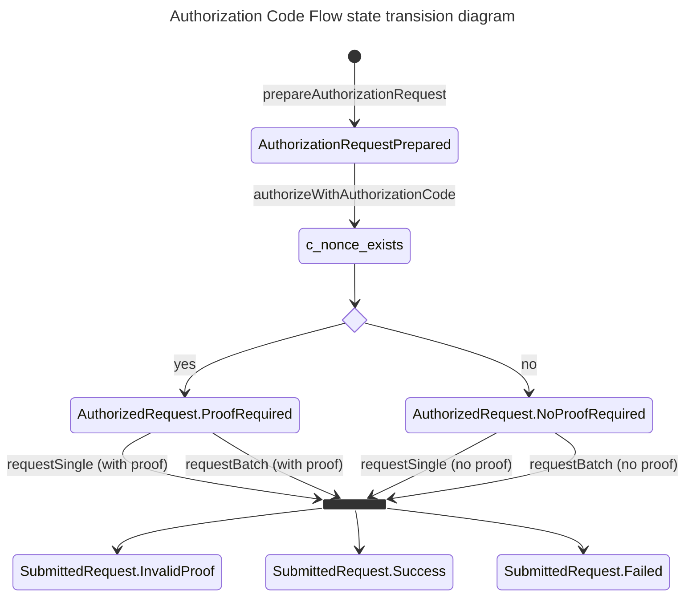
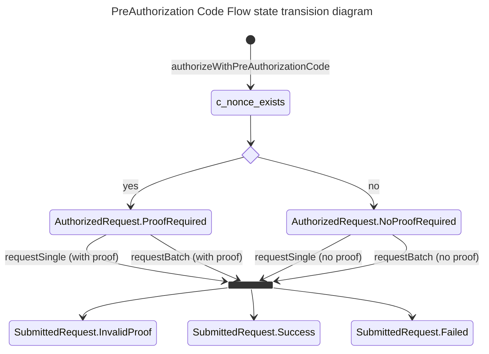

# EUDI OpenId4VCI library

:heavy_exclamation_mark: **Important!** Before you proceed, please read
the [EUDI Wallet Reference Implementation project description](https://github.com/eu-digital-identity-wallet/.github/blob/main/profile/reference-implementation.md)

[](https://www.apache.org/licenses/LICENSE-2.0)

## Table of contents

* [Overview](#overview)
* [Disclaimer](#disclaimer)
* [How to use](#how-to-use)  
* [Features supported](#features-supported)
* [How to contribute](#how-to-contribute)
* [License](#license)


## Overview

This is a Kotlin library, targeting JVM, that supports 
the [OpenId4VCI (draft 13)](https://openid.net/specs/openid-4-verifiable-credential-issuance-1_0-13.html) protocol.
In particular, the library focuses on the wallet's role in the protocol to:
- Resolve credential issuer metadata 
- Resolve metadata of the authorization server protecting issuance services
- Resolve a credential offer presented by an issuer service
- Negotiate authorization of a credential issuance request
- Submit a credential issuance request


## Disclaimer

The released software is an initial development release version: 
-  The initial development release is an early endeavor reflecting the efforts of a short timeboxed period, and by no means can be considered as the final product.  
-  The initial development release may be changed substantially over time, might introduce new features but also may change or remove existing ones, potentially breaking compatibility with your existing code.
-  The initial development release is limited in functional scope.
-  The initial development release may contain errors or design flaws and other problems that could cause system or other failures and data loss.
-  The initial development release has reduced security, privacy, availability, and reliability standards relative to future releases. This could make the software slower, less reliable, or more vulnerable to attacks than mature software.
-  The initial development release is not yet comprehensively documented. 
-  Users of the software must perform sufficient engineering and additional testing in order to properly evaluate their application and determine whether any of the open-sourced components is suitable for use in that application.
-  We strongly recommend to not put this version of the software into production use.
-  Only the latest version of the software will be supported

## How to use

Library provides the following main api elements to facilitate consumers of this api with the operations related to verifiable credentials issuance  

- **Issuer component**: A component that offers all operation required to authorize and submit a credential issuance request.
- **Credential offer resolver**: A component that interacts with credential issuer to resolve and validate a credential offer presented by the issuer.  
- **Metadata resolvers**: Components that interact with credential issuer and its authorization server to obtain and parse their metadata.  


### Credential Issuance

The process of requesting an issuance has been implemented as a stateful process whose steps are depicted as dedicated states holding the outcome of each step. 
Depending on the state of the process, specific transitions are allowed to move the process to the next step. 

VCI specification defines two flows of issuance;
- Authorization Code Flow (wallet-initiated flow)
- Pre-Authorization Code Flow. In this flow, before initiating the flow with the Wallet, the Credential Issuer first conducts the steps required to prepare the Credential issuance.

The following state diagrams sketch each flow's states and their allowed transitions. 





[Issuer](src/main/kotlin/eu/europa/ec/eudi/openid4vci/Issuer.kt) is the component that facilitates the authorization and submission of a credential issuance request (batch or single).
It is the main entry point for the functionality provided from the library

#### Initialize an Issuer

An [Issuer](src/main/kotlin/eu/europa/ec/eudi/openid4vci/Issuer.kt) component is initialized against a credential offer either resolved from an issuance service credential offer URL or manually constructed. 
The [Issuer](src/main/kotlin/eu/europa/ec/eudi/openid4vci/Issuer.kt) interface provides a factory method to construct an issuer component. 

```kotlin
import eu.europa.ec.eudi.openid4vci.*

val openId4VCIConfig = OpenId4VCIConfig(
    clientId = "wallet-dev", // the client id of wallet (acting as an OAUTH2 client)
    authFlowRedirectionURI = URI.create("eudi-wallet//auth"), // where the Credential Issuer should redirect after Authorization code flow succeeds
    keyGenerationConfig = KeyGenerationConfig.ecOnly(Curve.P_256), // what kind of ephemeral keys could be generated to encrypt credential issuance response
    credentialResponseEncryptionPolicy = CredentialResponseEncryptionPolicy.SUPPORTED // policy concerning the wallet's requirements for encryption of credential responses 
)
val credentialOffer: CredentialOffer = CredentialOfferRequestResolver().resolve(coUrl).getOrThrow()
val issuer = Issuer.make(openId4VCIConfig, credentialOffer).getOrThrow()
```
Construction of an Issuer might fail in case there is some incompatibility between credential issuer service's metadata and
the configuration OpenId4VCIConfig. Such an incompatibility can exist between the wallet's encryption requirements regarding credential 
responses and the encryption capabilities/requirements of the credential issuer service.

A resolved [CredentialOffer](src/main/kotlin/eu/europa/ec/eudi/openid4vci/CredentialOfferRequestResolver.kt) object contains the mandatory elements required for issuance.
- The issuer's identifier 
- The selected authorization server that will authorize the issuance
- The specific credentials that will be requested

#### Authorize request via Authorization Code Flow

Given an `issuer` that is initialized with a specific credential offer, use [Authorization Code Flow](https://openid.github.io/OpenID4VCI/openid-4-verifiable-credential-issuance-wg-draft.html#section-3.4) to authorize an issuance request.     

```kotlin
import eu.europa.ec.eudi.openid4vci.*

with(issuer) {
    val preparedAuthorizationRequest = prepareAuthorizationRequest().getOrThrow()
    val authorizationCode: String = ... // using url preparedAuthorizationRequest.authorizationCodeURL authenticate via front-channel on authorization server and retrieve authorization code 
    val authorizedRequest =
        preparedAuthorizationRequest.authorizeWithAuthorizationCode(
            AuthorizationCode(authorizationCode),
        ).getOrThrow()
}
```

#### Authorize request via Pre-Authorization Code Flow

Given an `issuer` that is initialized with a specific credential offer, use [Pre-Authorization Code Flow](https://openid.github.io/OpenID4VCI/openid-4-verifiable-credential-issuance-wg-draft.html#section-3.5) to authorize an issuance request.
It is expected that the credential offer will contain the pre-authorization code and defines the need to provide a pin or not. 

```kotlin
import eu.europa.ec.eudi.openid4vci.*

with(issuer) {
    val pin = ... // Pin retrieved from another channel 
    val authorizedRequest = authorizeWithPreAuthorizationCode(pin).getOrThrow()    
}
```

#### Request a single credential issuance

Given an `authorizedRequest` and in the context of an `issuer` a single credential issuance request can be placed as follows

```kotlin
import eu.europa.ec.eudi.openid4vci.*

with(issuer) {
    val requestPayload = IssuanceRequestPayload.ConfigurationBased(credentialConfigurationId, null)
    val submittedRequest = authorized.requestSingle(requestPayload, proofSigner).getOrThrow()

    when (submittedRequest) {
        is SubmittedRequest.Success -> {
            when (val issuedCredential = submittedRequest.credentials[0]) {
                is IssuedCredential.Issued -> issuedCredential.credential
                is IssuedCredential.Deferred -> {
                    deferredCredentialUseCase(issuer, authorized, issuedCredential)
                }
            }
        }
        is SubmittedRequest.Failed -> // handle failed request
        is SubmittedRequest.InvalidProof -> // handle specific case of missing or invalid proof(s) 
    }
}
```

**NOTE:** Only credentials that were included in credential offer that initialized the [Issuer](src/main/kotlin/eu/europa/ec/eudi/openid4vci/Issuer.kt) component can be passed. 

#### Request batch credential issuance

Given an `authorizedRequest` and in the context of an `issuer` a batch credential issuance request can be placed as follows

```kotlin
import eu.europa.ec.eudi.openid4vci.*

with(issuer) {    
    val submittedRequest = authorizedRequest.requestBatch(credentialsMetadata).getOrThrow()

    when (submittedRequest) {
        is SubmittedRequest.Success -> {
            val results = submittedRequest.credentials.map {
                when (it) {
                    is CredentialIssuanceResponse.Result.Issued -> it.credential
                    is CredentialIssuanceResponse.Result.Deferred -> it.transactionId
                }
            }            
        }
        is SubmittedRequest.Failed -> // handle failed request
        is SubmittedRequest.InvalidProof -> // handle specific case of missing or invalid proof 
    }
}
```

**NOTE:** Only credentials that were included in credential offer that initialized the [Issuer](src/main/kotlin/eu/europa/ec/eudi/openid4vci/Issuer.kt) component can be passed.

### Resolve a credential offer presented by issuer

A CredentialOfferRequestResolver uses internally the two metadata resolvers mentioned above to resolve metadata of issuer and its authorization server

Given a credential offer url use [CredentialOfferRequestResolver](src/main/kotlin/eu/europa/ec/eudi/openid4vci/CredentialOfferRequestResolver.kt) the following way to validate and resolve it to [CredentialOffer](src/main/kotlin/eu/europa/ec/eudi/openid4vci/CredentialOfferRequestResolver.kt)

```kotlin
import eu.europa.ec.eudi.openid4vci.*

val credentialOfferRequestResolver = CredentialOfferRequestResolver()
val credentialOffer: CredentialOffer = credentialOfferRequestResolver.resolve(coUrl).getOrThrow()
```

### Resolve Credential Issuer and authorization server metadata

To obtain the credentials issuer metadata use [CredentialIssuerMetadataResolver](src/main/kotlin/eu/europa/ec/eudi/openid4vci/CredentialIssuerMetadataResolver.kt) the following way

```kotlin
import eu.europa.ec.eudi.openid4vci.*

val credentialIssuerIdentifier = CredentialIssuerId("https://....").getOrThrow() // credential issuer id is a https url with no query or fragment components
val resolver = CredentialIssuerMetadataResolver() // get a default implementation of the CredentialIssuerMetadataResolver interface 
val metadata: CredentialIssuerMetadata = resolver.resolve(credentialIssuerIdentifier).getOrThrow()  // fetch and parse credential issuer metadata
```
In case of metadata parsing failure a `Result.failure()` will be returned to caller wrapping the exception thrown while parsing metadata.

To obtain the authorization server's  metadata use [AuthorizationServerMetadataResolver](src/main/kotlin/eu/europa/ec/eudi/openid4vci/AuthorizationServerMetadataResolver.kt) the following way
```kotlin
import eu.europa.ec.eudi.openid4vci.*

val resolver = AuthorizationServerMetadataResolver() // get a default implementation of the AuthorizationServerMetadataResolver interface
val metadata: CIAuthorizationServerMetadata = resolver.resolve(HttpsUrl("https://...")).getOrThrow() // fetch and parse authorization server metadata
```

There is also a convenient method that obtains the credentials issuer metadata & the metadata of all
authorization servers with a single call

```kotlin
import eu.europa.ec.eudi.openid4vci.*

val credentialIssuerIdentifier = CredentialIssuerId("https://....").getOrThrow()
val (issuerMetadata, authServersMetadata) = Issuer.metaData(httpClient, credentialIssuerIdentifier)
```

## Features supported

### Issuer metadata 
In [section 11.2.2](https://openid.net/specs/openid-4-verifiable-credential-issuance-1_0-13.html#section-11.2.2) specification recommends the use of header `Accept-Language` to indicate the language(s) preferred for display.
Current version of the library does not support this. 
In [section 11.2.3](https://openid.net/specs/openid-4-verifiable-credential-issuance-1_0-13.html#section-11.2.3) specification details the metadata an issuer advertises through its metadata endpoint.
Current version of the library supports all metadata specified there except `signed_metadata` attribute.

### Authorization
Specification defines ([section 5.1.1](https://openid.net/specs/openid-4-verifiable-credential-issuance-1_0-13.html#section-5.1.1)) that a credential's issuance 
can be requested using `authorization_details` or `scope` parameter when using authorization code flow. Current version of the library supports usage of both parameters.
Though for `authorization_details` we don't yet support the `format` attribute and its specializations per profile as specified in [Appendix A](https://openid.net/specs/openid-4-verifiable-credential-issuance-1_0-13.html#appendix-A).
Only `credential_configuration_id` attribute is supported.

The same stands for the **token endpoint** when (as specified in [section 6.2](https://openid.net/specs/openid-4-verifiable-credential-issuance-1_0-13.html#section-6.2)) server response includes 
`authorization_details`. In this case too library does not support authorization details that include `format` attribute. 

### Credential Request
Current version of the library implements integrations with issuer's [Credential Endpoint](https://openid.net/specs/openid-4-verifiable-credential-issuance-1_0-13.html#name-credential-endpoint),
[Batch Credential Endpoint](https://openid.net/specs/openid-4-verifiable-credential-issuance-1_0-13.html#name-batch-credential-endpoint),
[Deferred Credential Endpoint](https://openid.net/specs/openid-4-verifiable-credential-issuance-1_0-13.html#name-deferred-credential-endpoin) and
[Notification Endpoint](https://openid.net/specs/openid-4-verifiable-credential-issuance-1_0-13.html#name-notification-endpoint).

#### Credential Format Profiles
OpenId4VCI specification defines several extension points to accommodate the differences across Credential formats. The current version of the library fully supports **ISO mDL** and **IETF SD-JWT VC** profiles.  

#### Proof Types
OpenId4VCI specification (draft 13) defines two types of proofs that can be included in a credential issuance request, JWT proof type and CWT proof type. Current version of the library supports only JWT proof types

## How to contribute

We welcome contributions to this project. To ensure that the process is smooth for everyone
involved, follow the guidelines found in [CONTRIBUTING.md](CONTRIBUTING.md).

## License

### Third-party component licenses

* OAUTH2 & OIDC Support: [Nimbus OAuth 2.0 SDK with OpenID Connect extensions](https://connect2id.com/products/nimbus-oauth-openid-connect-sdk)
* URI parsing: [Uri KMP](https://github.com/eygraber/uri-kmp)
* Http Client: [Ktor](https://ktor.io/)
* Json : [Kotlinx Serialization](https://github.com/Kotlin/kotlinx.serialization)

### License details

Copyright (c) 2023 European Commission

Licensed under the Apache License, Version 2.0 (the "License");
you may not use this file except in compliance with the License.
You may obtain a copy of the License at

    http://www.apache.org/licenses/LICENSE-2.0

Unless required by applicable law or agreed to in writing, software
distributed under the License is distributed on an "AS IS" BASIS,
WITHOUT WARRANTIES OR CONDITIONS OF ANY KIND, either express or implied.
See the License for the specific language governing permissions and
limitations under the License.
