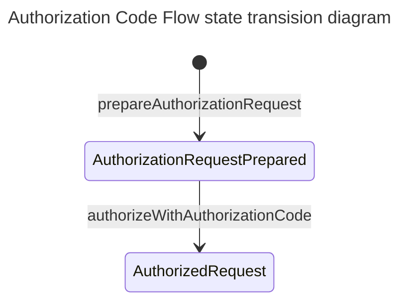
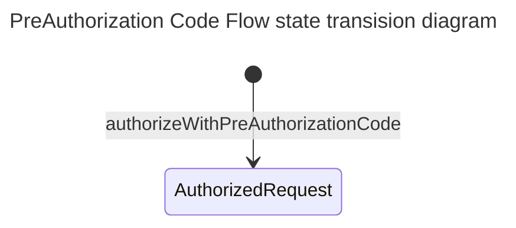

# EUDI OpenId4VCI library

:heavy_exclamation_mark: **Important!** Before you proceed, please read
the [EUDI Wallet Reference Implementation project description](https://github.com/eu-digital-identity-wallet/.github/blob/main/profile/reference-implementation.md)

[](https://www.apache.org/licenses/LICENSE-2.0)

## Table of contents

* [Overview](#overview)
* [Disclaimer](#disclaimer)
* [Use cases supported](#use-cases-supported)
* [Configuration options](#configuration-options)
* [Other features](#other-features)
* [Features not supported](#features-not-supported)
* [How to contribute](#how-to-contribute)
* [License](#license)


## Overview

This is a Kotlin library, targeting JVM, that supports
the [OpenId4VCI (draft 15)](https://openid.net/specs/openid-4-verifiable-credential-issuance-1_0-15.html) protocol.

In particular, the library focuses on the wallet's role in and provides the following features:

| Feature                                                                                         | Coverage                                                                                                           |
|-------------------------------------------------------------------------------------------------|--------------------------------------------------------------------------------------------------------------------|
| [Wallet-initiated issuance](#wallet-initiated-issuance)                                         | ✅                                                                                                                  |
| [Resolve a credential offer](#resolve-a-credential-offer)                                       | ✅ Unsigned metadata ✅ signed metadata ❌ [accept-language](#issuer-metadata-accept-language)                        |
| [Authorization code flow](#authorization-code-flow)                                             | ✅                                                                                                                  |
| [Pre-authorized code flow](#pre-authorized-code-flow)                                           | ✅                                                                                                                  |
| mso_mdoc format                                                                                 | ✅                                                                                                                  |
| SD-JWT-VC format                                                                                | ✅                                                                                                                  |
| W3C VC DM                                                                                       | VC Signed as a JWT, Not Using JSON-LD                                                                              |
| [Place credential request](#place-credential-request)                                           | ✅ Including automatic handling of `invalid_proof` & multiple proofs                                                |
| [Query for deferred credentials](#query-for-deferred-credentials)                               | ✅ Including automatic refresh of `access_token`                                                                    |
| [Query for deferred credentials at a later time](#query-for-deferred-credentials-at-later-time) | ✅ Including automatic refresh of `access_token`                                                                    |
| [Notify credential issuer](#notify-credential-issuer)                                           | ✅                                                                                                                  | 
| Proof                                                                                           | ✅ JWT                                                                                                              |
| Credential response encryption                                                                  | ✅                                                                                                                  |
| [Pushed authorization requests](#pushed-authorization-requests)                                 | ✅ Used by default, if supported by issuer                                                                          |
| [Demonstrating Proof of Possession (DPoP)](#demonstrating-proof-of-possession-dpop)             | ✅                                                                                                                  |
| [PKCE](#proof-key-for-code-exchange-by-oauth-public-clients-pkce)                               | ✅                                                                                                                  |
| Wallet authentication                                                                           | ✅ public client, <br/>✅ [Attestation-Based Client Authentication](#oauth2-attestation-based-client-authentication) |
| Use issuer's nonce endpoint to get c_nonce for proofs                                           | ✅                                                                                                                  |
| `attestation` proof type                                                                        | ❌                                                                                                                  |
| `key_attestation` to the JWT Proof (JOSE header)                                                | ❌                                                                                                                  |
| Wallet attestation                                                                              | ❌                                                                                                                  |


## Disclaimer

The released software is an initial development release version:
-  The initial development release is an early endeavor reflecting the efforts of a short timeboxed period, and by no means can be considered as the final product.
-  The initial development release may be changed substantially over time, might introduce new features but also may change or remove existing ones, potentially breaking compatibility with your existing code.
-  The initial development release is limited in functional scope.
-  The initial development release may contain errors or design flaws and other problems that could cause system or other failures and data loss.
-  The initial development release has reduced security, privacy, availability, and reliability standards relative to future releases. This could make the software slower, less reliable, or more vulnerable to attacks than mature software.
-  The initial development release is not yet comprehensively documented.
-  Users of the software must perform sufficient engineering and additional testing in order to properly evaluate their application and determine whether any of the open-sourced components is suitable for use in that application.
-  We strongly recommend to not put this version of the software into production use.
-  Only the latest version of the software will be supported

## Use cases supported

### Wallet-initiated issuance

As a wallet/caller having an out-of-band knowledge of a credential issuer,
use the library to initiate issuance:

- Fetch and validate the Credential Issuer Metadata
- Fetch and validate the OAUTH2 or OIDC metadata used by the Credential Issuer
- Ensure that out-of-band knowledge is valid

This is equivalent to [resolving a credential offer](#resolve-a-credential-offer), having authorization code grant, without issuer state.

#### Wallet-initiated issuance preconditions

- The wallet knows the credential issuer id
- The wallet knows one or more credential configuration ids 
- The wallet has prepared an issuance [configuration](#configuration-options), describing the capabilities & policies of the wallet.

#### Wallet-initiated issuance successful outcome

Same as [outcome](#resolve-a-credential-offer-successful-outcome), as if a 
equivalent offer was resolved.

#### Wallet-initiated issuance steps

1. Wallet/caller using the library to instantiate an [Issuer](src/main/kotlin/eu/europa/ec/eudi/openid4vci/Issuer.kt)
2. If checks pass, an `Issuer` will be returned to the caller.

#### Wallet-initiated issuance execution 

```kotlin
import eu.europa.ec.eudi.openid4vci.*

val openId4VCIConfig = ...
val credentialIssuerId: CredentialIssuerId = //known 
val credentialConfigurationIds: List<CredentialConfigurationIdentifier> = // known

val issuer = 
    Issuer.makeWalletInitiated(
        config,
        credentialIssuerId,
        credentialConfigurationIds
    ).getOrThrow()
```
#### Wallet-initiated issuance next steps

- [Authorize wallet for issuance](#authorize-wallet-for-issuance) 

### Resolve a credential offer

As a wallet/caller use the library to process a URI that represents a credential offer 
- to make sure that it is a valid offer, 
- comes from an issuer which advertises properly its metadata and that
- this offer is compatible with wallet configuration.

#### Resolve a credential offer preconditions

- The wallet has got this URI. Typically, either scanning a QR Code or in response to a custom URI.
- The wallet has prepared an issuance [configuration](#configuration-options), describing the capabilities & policies of the wallet.

This resolution includes the following

- Check and validate the structure of the URI
- Fetch the actual contents of the offer, in case URI points by reference to the offer
- Fetch and validate the Credential Issuer Metadata
- Fetch and validate the OAUTH2 or OIDC metadata used by the Credential Issuer
- Ensure that credential offer is aligned to both the above metadata & wallet issuance configuration

#### Resolve a credential offer successful outcome:

An instance of the [Issuer](src/main/kotlin/eu/europa/ec/eudi/openid4vci/Issuer.kt) interface (the main entry point to the library) will have been initiated.
This instance includes the resolved [CredentialOffer](src/main/kotlin/eu/europa/ec/eudi/openid4vci/CredentialOfferRequestResolver.kt) and the necessary methods to proceed.
The resolved offer contains the mandatory elements required for issuance.
- The issuer's identifier
- The selected authorization server that will authorize the issuance
- The specific credentials that will be requested

These elements can be used to populate a wallet view that 
asks user's consensus to proceed with the issuance. This includes  the authorization
flow to be used (either authorization code flow, or pre-authorized code)

This concern, though, is out of the scope of the library

#### Resolve a credential offer execution

To resolve a credential offer, wallet/caller must provide [configuration options](#configuration-options)

```kotlin
import eu.europa.ec.eudi.openid4vci.*

val openId4VCIConfig = ...
val credentialOfferUri: String = "..."
val issuer = Issuer.make(openId4VCIConfig, credentialOfferUri).getOrThrow()
```

#### Resolve a credential offer next steps

- [Authorize wallet for issuance](#authorize-wallet-for-issuance)

### Authorize wallet for issuance

As a wallet/caller use the library to obtain an `access_token`, to be able to access 
the credential issuer's protected endpoints

#### Authorize wallet for issuance preconditions

- A credential offer has been [resolved](#resolve-a-credential-offer), and as a result
- An instance of the `Issuer` interface has been instantiated

There are three distinct cases, depending on the content of the credential offer

- [Use authorization code flow](#authorization-code-flow)
- [Use pre-authorized code flow](#pre-authorized-code-flow)
- A credential offer supporting both flows. In this case, the caller/wallet must select which 
flow to use. This decision is out of the scope of the library, although pre-authorized code flow
perhaps is more convenient since it includes fewer steps. 

#### Authorize wallet for issuance successful outcome:

At the end of the use case, wallet will have an `AuthorizedRequest` instance.

`AuthorizedRequest` will contain the `access_token` (bearer or [DPoP](#demonstrating-proof-of-possession-dpop)), if provided 
the `refresh_token` and authorization and/or resource server DPoP nonce if provided.

#### Authorize wallet for issuance next steps

- [Place credential request](#place-credential-request)

### Authorization code flow



#### Authorization code flow preconditions

In addition to the [common authorization preconditions](#authorize-wallet-for-issuance-preconditions)

- The credential offer specifies authorization code flow, or
- Wallet/Caller decides to use this flow

#### Authorization code flow steps

1. Wallet/caller using asks the `Issuer` instance to prepare a URL where the mobile device browser needs to be pointed to.
Library prepares this URL as follows
   - If [PAR](#pushed-authorization-requests) endpoint is advertised it will place a PAR request and assemble the URL for the authorization endpoint
   - If PAR endpoint is not supported (or disabled), it will assemble the URL, as normally, for the authorization endpoint
   - In both cases [PKCE](#proof-key-for-code-exchange-by-oauth-public-clients-pkce) will be used
2. Wallet/Caller opens the mobile's browser to the URL calculated in the previous step
3. User interacts with the authorization server via mobile device agent, typically providing his authorization
4. On success, authorization redirects to a wallet provided `redirect_uri`, providing the `code` and a `state` parameters
5. Using the `Issuer` instance exchange the `authorization code` for an `access_token`.

In the scope of the library are steps 1 and 5.

#### Authorization code flow execution

```kotlin
import eu.europa.ec.eudi.openid4vci.*

// Step 1
val preparedAuthorizationRequest = 
    with(issuer) {
        prepareAuthorizationRequest().getOrThrow()
    }
// Step 2
// Wallet opens mobile's browser and points it to 

// Step 4
// Wallet has extracted from authorization redirect_uri
// the code and state parameters
val (authorizationCode, state) = ... // using url preparedAuthorizationRequest.authorizationCodeURL authenticate via front-channel on authorization server and retrieve authorization code 

// Step 5
val authorizedRequest =
     with(issuer) {
         with(preparedAuthorizationRequest) {
             authorizeWithAuthorizationCode(AuthorizationCode(authorizationCode),state).getOrThrow()
         }
     }
```

> [!TIP]
> If credential issuer supports `authorization_details`, caller can 
> reduce the scope of the `access_token` by passing `authorization_details` also to the token endpoint.
> Function `authorizeWithAuthorizationCode` supports this via parameter `authDetailsOption: AccessTokenOption`

### Pre-authorized code flow



#### Pre-authorized code flow preconditions

In addition to the [common authorization preconditions](#authorize-wallet-for-issuance-preconditions)

- The credential offer specifies pre-authorized code flow or 
- Wallet/caller decided to use this flow
- Optionally, wallet has received via another channel a `tx_code`  
- Wallet has gathered from the user this `tx_code` value, if needed
 
Steps:
1. Using the `Issuer` instance exchange the pre-authorized code & optionally the `tx_code` with an `access_token`
2. Library will place an adequate request the token endpoint of the credential issuer
3. Library will receive token endpoint response and map it to a `AuthorizedRequest`


#### Pre-authorized code flow execution

```kotlin
import eu.europa.ec.eudi.openid4vci.*

val txCode : Sting? = ... // Pin retrieved from another channel, if needed

val authorizedRequest =  
    with(issuer) {
         authorizeWithPreAuthorizationCode(txCode).getOrThrow()
    }
```

> [!TIP]
> If credential issuer supports `authorization_details`, caller can
> reduce the scope of the `access_token` by passing `authorization_details` to the token endpoint.
> Function `authorizeWithPreAuthorizationCode` supports this via parameter `authDetailsOption: AccessTokenOption`


### Place credential request

Wallet/caller wants to place a request against the credential issuer, for one of 
the credential configurations that were present in the offer, or alternatively for 
a specific credential identifier in case token endpoint provided an `authorization_details`.

#### Place credential request preconditions

- An instance of the `Issuer` interface has been instantiated
- [Wallet authorization](#authorize-wallet-for-issuance) has been performed and as a result
- An instance of `AuthorizedRequest` is available
- Wallet/Caller has decided for which `credential_configuration_id` - found in the offer - the request will be placed for
- Wallet/Caller has decided which `credential_identifier` - optional attribute found in the `AuthorizedRequest` - the request will be placed for
- Wallet/Caller is ready to provide one or more suitable Proof signers for JWT proofs, if applicable

#### Place credential request steps

1. Wallet/caller using the library assembles the request providing a `credential_configuration_id` and/or optionally a `credential_identifier`
2. Wallet/caller using the `Issuer` and `AuthorizedRequest` place the request 
3. Library places the appropriate request against the Credential Endpoint of the Credential Issuer
4. Library receives the Credential Issuer response and maps it to a `SubmissionOutcome`
5. Wallet/caller gets back the `SubmissionOutcome` for further processing

#### Place credential request outcome

The result of placing a request is represented by a `SubmissionOutcome` as follows:

- `SubmissionOutcome.Sucess` This represents one or more issued credentials, or
- `SubmissionOutcome.Deferred` This indicates a deferred issuance and contains a `transaction_id`
- `SubmissionOutcome.Failed` indication that credential issuer rejected the request.

In case of an unexpected error, a runtime exception will be raised.

#### Place credential request execution

```kotlin
import eu.europa.ec.eudi.openid4vci.*

val popSigner: PopSigner? = // optional JWT or CWT signer. Required only if proof are required by issuer
val claimSetToRequest : ClaimSet? = null // null indicates that all claims will be requested    

// Step 1
// Assemble the request    
val request = 
    IssuanceRequestPayload.ConfigurationBased(credentialConfigurationId, claimSetToRequest)

// Place the request
val (updatedAuthorizedRequest, outcome) =
    with(issuer) {
        with(authorizedRequest) {
            request(request, listOf(popSigner))
        }
    }

```

> [!TIP]
> If more than one `popSigner` are passed to function `request` 
> multiple instances of the credential will be issued, provided that
> credential issuer supports batch issuance. 

> [!NOTE]
> 
> Library evaluates if proofs are needed to be sent   
> - If pop signers are provided from caller.
> - If the requested credential's configuration states so.
> 
> If issuer advertises a nonce endpoint library will use it to include a nonce in the generated proofs.  


#### Place credential request next steps

- Validate credential and store it. That's out of library scope, or
- [Query for credential](#query-for-deferred-credentials), or
- [Query for credentials at later time](#query-for-deferred-credentials-at-later-time), or
- [Notify credential issuer](#notify-credential-issuer)

### Query for deferred credentials

Wallet/caller wants to query credential issuer for credentials, while still holding
an `AuthorizedRequest` and an `Issuer` instance.

#### Query for deferred credentials preconditions

- Wallet/caller has [placed a credential request](#place-a-credential-request)
- Wallet/caller has received a [deferred outcome](#place-credential-request-outcome) carrying a `transaction_id`
- Wallet/caller has an instance of `AuthorizedRequest` 

#### Query for deferred credentials steps

1. Wallet/caller issuing the `Issuer` instance places the query providing `AuthorizedRequest` and `transaction_id`
2. Library checks if `access_token`  in `AuthorizedRequest` is expired
3. If `access_token` is expired it will automatically be refreshed, if credential issuer has given a `refresh_token`
4. Library places the query against the Deferred Endpoint of the credential issuer
5. Library gets credential issuer response and maps it into `DeferredCredentialQueryOutcome`
6. Caller gets back an `AuthorizedRequest` and `DeferredCredentialQueryOutcome`

#### Query for deferred credentials outcome

The outcome of placing this query is a pair comprised of  

- `AuthorizedRequest` : This represents a possibly updated `AuthorizedRequest` with a refreshed `access_token`
- `DeferredCredentialQueryOutcome`: This is the response of the deferred endpoint and it could be one of
  - `Issued` : Deferred credentials were issued and optionally a `notification_id` 
  - `IssuancePending`: Deferred credential was not ready
  - `Errored`: Credential issuer doesn't recognize the `transaction_id`

#### Query for deferred credentials execution

```kotlin
val authorizedRequest = // has been retrieved in a previous step
val deferredCredential = // has been retrieved in a previous step. Holds the transaction_id

val (updatedAuthorizedRequest, outcome) =  
    with(issuer) {
        with(authorizedRequest) {
            queryForDeferredCredential(deferredCredential).getOrThrow()
        }
    }    

```
#### Query for deferred credentials next steps

- Validate credential and store it. That's out of library scope, or
- [Query for credentials](#query-for-deferred-credentials)

### Query for deferred credentials at later time

Wallet/caller wants to suspend an issuance process, store its context and query issuer at a later time.
There are limitations for this use case

- The lifecycle of `transaction_id` is bound to the expiration of the `access_token`.
- The `access_token` can be refreshed, the library transparently does this, only if credential issuer has provided a `refresh_token`

This means that wallet/caller can query for deferred credentials as long as it has a non-expired
`access_token` or `refresh_token`.

#### Query for deferred credentials at later time preconditions

As per [query for deferred credentials](#query-for-deferred-credentials-preconditions)

#### Query for deferred credentials at a later time steps

1. Wallet/caller using the `Issuer` instance obtains a `DeferredIssuanceContext`. That's a minimum set of data (configuration options and state) that are needed to query again the credential issuer
2. Wallet/caller stores the `DeferredIssuanceContext`. How this is done is outside the scope of the library
3. Wallet/caller loads the `DeferredIssuanceContext`. That's also outside the scope of the library
4. Wallet/caller queries the credential issuer issuing `DeferredIssuer`
5. Library performs all steps defined in [Query for deferred credentials](#query-for-deferred-credentials)
6. Library returns to the caller the `DeferredIssuanceContxt?` and the `DeferredCredentialQueryOutcome`
7. Depending on the outcome, wallet/caller may choose to store the new `DeferredIssuanceContxt` to query again, later on

#### Query for deferred credentials at later time outcome

The outcome of placing this query is a pair comprised of
- `DeferredIssuanceContext` : This represents a possibly new state of authorization carrying a refreshed `access_token`
- `DeferredCredentialQueryOutcome`: This is the response of the deferred endpoint and it could be one of
    - `Issued` : One or more deferred credentials were issued
    - `IssuancePending`: One or more deferred credentials were not ready
    - `Errored`: Credential issuer doesn't recognize the `transaction_id`

#### Query for deferred credentials at later time execution

```kotlin

val authorizedRequest = // has been retrieved in a previous step
val deferredCredential = // has been retrieved in a previous step. Holds the transaction_id
    
// Step 1
val deferredCtx = 
    with(issuer) {
        with(authorizedRequest) {
            deferredContext(deferredCredential).getOrThrough()    
        }
    }

// Store context

// Load context

// Step 4
val (updatedDeferredCtx, outcome) = 
    DeferredIssuer.queryForDeferredCredential(deferredCtx).getOrThrough()
```
#### Serializing `DeferredIssuanceContext`

How waller/caller stores and loads the `DeferredIssuanceContext` is out of scope
of the library. 

There is though an [indicative implementation](src/test/kotlin/eu/europa/ec/eudi/openid4vci/examples/DeferredIssuerExtensions.kt) 
that serializes the context as a JSON object.


### Notify Credential Issuer

Wallet/caller wants to notify the credential issuer about the overall 
outcome of the issuance, using one of the defined notifications:

- Accepted: Credentials were successfully stored in the Wallet
- Deleted: Unsuccessful Credential issuance was caused by a user action.
- Failed: Other unsuccessful cases

#### Notify Credential Issuer preconditions

- Credential issuer advertises the optional Notification Endpoint
- Wallet/caller has received a `notificationId`   
  (via credential [response](#place-credential-request-outcome), deferred [response](#query-for-deferred-credentials-outcome))  
- Wallet/caller has processed the issued credentials (verification & storage)
- Wallet/caller still has a reference to the `Issuer` and `AuthorizedRequest` instances

#### Notify Credential Issuer outcome

The use case always succeeds, even in the case of an unexpected error.

#### Notify Credential Issuer steps

1. Wallet/caller using the library creates a notification event
2. Wallet/caller using the `Issuer` instance places the notification to the credential issuer

#### Notify Credential Issuer execution

```kotlin
val authorizedRequest = // has been retrieved in a previous step
val notificationId = // has been provided by the issuer

// Step 1
// Other events are Deleted and Failed    
val event = 
    CredentialIssuanceEvent.Accepted(notificationId, "Got it!")

// Step 2
with(issuer){
    with(authorizedRequest){
        notify(event).getOrNull()
    }
}
```

## Configuration Options

The options available for the `Issuer` are represented by `OpenId4VCIConfig`

```kotlin
data class OpenId4VCIConfig(
    val client: Client,
    val authFlowRedirectionURI: URI,
    val keyGenerationConfig: KeyGenerationConfig,
    val credentialResponseEncryptionPolicy: CredentialResponseEncryptionPolicy,
    val authorizeIssuanceConfig: AuthorizeIssuanceConfig = AuthorizeIssuanceConfig.FAVOR_SCOPES,
    val dPoPSigner: PopSigner.Jwt? = null,
    val clientAttestationPoPBuilder: ClientAttestationPoPBuilder = ClientAttestationPoPBuilder.Default,
    val parUsage: ParUsage = ParUsage.IfSupported,
    val clock: Clock = Clock.systemDefaultZone(),
    val issuerMetadataPolicy: IssuerMetadataPolicy = IssuerMetadataPolicy.IgnoreSigned,
)
```

Options available:

- client: Wallet `client authentication method` in the OAUTH2 sense while interacting with the Credential Issuer. 
  - Either Public Client,
  - [Attestation-Based Client Authentication](#oauth2-attestation-based-client-authentication)
- authFlowRedirectionURI: It is the `redirect_uri` parameter that will be included in a PAR or simple authorization request.
- keyGenerationConfig: A way of generating ephemeral keys used for `credential_response_encryption`
- credentialResponseEncryptionPolicy: A wallet policy in regard to whether it accepts credentials without `credential_response_encyrption` or not
- authorizeIssuanceConfig: Preference on using `scope` or `authorization_details` during authorization code flow
- dPoPSigner: An optional way of singing DPoP JWTs. If not provided DPoP is off. If provided, it will be used only if Credential Issuer advertises this feature
- parUsage: An indication to not use PAR endpoint or use it if advertised by the credential issuer
- clock: Wallet/Caller clock.
- issuerMetadataPolicy: Wallet policy concerning Credential Issuer metadata. Possible options:
  - `IssuerMetadataPolicy.RequireSigned`: require the presence of signed metadata and use only values from signed metadata
  - `IssuerMetadataPolicy.PreferSigned`: presence of signed metadata is optional, if present values from signed metadata take precedence
  - `IssuerMetadataPolicy.IgnoreSigned`: signed metadata are ignored

Trust between the Wallet and the Signer of the signed metadata advertised by the Credential Issuer is established using one of the following ways:
- `IssuerTrust.ByPublicKey`: trusting the public key used to sign the metadata
- `IssuerTrust.ByCertificateChain` trusting a certificate chain, the leaf certificate of which must contain the public key used to sign the metadata - in this case the Signed JWT must contain the 'x5c' header claim 


```kotlin
import eu.europa.ec.eudi.openid4vci.*

val openId4VCIConfig = OpenId4VCIConfig(
    client = Client.Public("wallet-dev"), // the client id of wallet (acting as an OAUTH2 client)
    authFlowRedirectionURI = URI.create("eudi-wallet//auth"), // where the Credential Issuer should redirect after Authorization code flow succeeds
    keyGenerationConfig = KeyGenerationConfig.ecOnly(Curve.P_256), // what kind of ephemeral keys could be generated to encrypt credential issuance response
    credentialResponseEncryptionPolicy = CredentialResponseEncryptionPolicy.SUPPORTED, // policy concerning the wallet's requirements for encryption of credential responses
)
val credentialOfferUri: String = "..." 
val issuer = Issuer.make(openId4VCIConfig, credentialOfferUri).getOrThrow()
```

## Other features

### Pushed authorization requests

Library supports [RFC 9126 OAuth 2.0 Pushed Authorization Requests](https://www.rfc-editor.org/rfc/rfc9126)
To use the PAR endpoint 
- wallet [configuration](#configuration-options) shouldn't exclude its use (explicit configuration option) and 
- PAR should be advertised by credential issuer's metadata

Library will automatically use the PAR endpoint during the [authorization code flow](#authorization-code-flow), 
otherwise it will fall back to a regular authorization request.

### Proof Types Supported

The current version of the library supports JWT proofs

### Demonstrating Proof of Possession (DPoP)

Library supports [RFC9449](https://datatracker.ietf.org/doc/html/rfc9449). In addition to
bearer authentication scheme, library can be configured to use DPoP authentication provided
that the authorization server, that protects the credential issuer, supports this feature as well.

If wallet [configuration](#configuration-options) provides a DPoP Signer and if the credential issuer advertises DPoP with
algorithms supported by wallet's DPoP Signer, then library will transparently request
for a DPoP `access_token` instead of the default Bearer token.

Furthermore, all further interactions will use the correct token type (Bearer or DPoP)

Library supports both
[Authorization Server-Provided Nonce](https://datatracker.ietf.org/doc/html/rfc9449#name-authorization-server-provid) and
[Resource Server-Provided Nonce](https://datatracker.ietf.org/doc/html/rfc9449#name-resource-server-provided-no). It
features automatic recovery/retry support, and is able to recover from `use_dpop_nonce` errors given that a new DPoP
Nonce is provided in the `DPoP-Nonce` header. Finally, library refreshes DPoP Nonce whenever a new value is provided,
either by the Authorization Server or the Credential Issuer, using the `DPoP-Nonce` header, and all subsequent
interactions use the newly provided DPoP Nonce value.

###  Proof Key for Code Exchange by OAuth Public Clients (PKCE)

Library supports [RFC7636](https://www.rfc-editor.org/rfc/rfc7636.html) by default 
while performing [Authorization code flow](#authorization-code-flow). 
This feature cannot be disabled.

### OAUTH2 Attestation-Based Client Authentication

Library supports [OAUTH2 Attestation-Based Client Authentication - Draft 03](https://www.ietf.org/archive/id/draft-ietf-oauth-attestation-based-client-auth-03.html)

To enable this, caller must have obtained a [Client/Wallet Attestation JWT](https://www.ietf.org/archive/id/draft-ietf-oauth-attestation-based-client-auth-03.html#name-client-attestation-jwt)
How this is done, it is outside the scope of the library.

Furthermore, caller must provide a specification on how to produce the [Client Attestation PoP JWT](https://www.ietf.org/archive/id/draft-ietf-oauth-attestation-based-client-auth-03.html#name-client-attestation-pop-jwt)

```kotlin

val clientAttestationJWT: ClientAttestationJWT("...")
val popJwtSpec: ClientAttestationPoPJWTSpec = ClientAttestationPoPJWTSpec(
    signingAlgorithm = JWSAlgorithm.ES256, // Algorithm to sign the PoP JWT
    duration = 1.minutes, // Duration of PoP JWT. Used for `exp` claim 
    typ = null, // Optional, `typ` claim in the JWS header
    jwsSigner = signer, // Nimbus signer
)  
val wallet = Client.Attested(clientAttestationJWT, popJwtSpec)
val openId4VCIConfig = OpenId4VCIConfig(
    client = wallet
    authFlowRedirectionURI = URI.create("eudi-wallet//auth"), // where the Credential Issuer should redirect after Authorization code flow succeeds
    keyGenerationConfig = KeyGenerationConfig.ecOnly(Curve.P_256), // what kind of ephemeral keys could be generated to encrypt credential issuance response
    credentialResponseEncryptionPolicy = CredentialResponseEncryptionPolicy.SUPPORTED, // policy concerning the wallet's requirements for encryption of credential responses
)
```
With this configuration library is able to 
- Automatically generate the Client Attestation PoP JWT, with every call to the PAR and/or Token endpoint
- Populate the [HTTP headers](https://www.ietf.org/archive/id/draft-ietf-oauth-attestation-based-client-auth-03.html#name-client-attestation-http-hea) when accessing PAR and/or Token endpoints 

Library will check that the authorization server of the issuer, 
includes method `attest_jwt_client_auth` in claim `token_endpoint_auth_methods_supported`
of its metadata.

## Features not supported

### Issuer metadata accept-language

[Specification](https://openid.net/specs/openid-4-verifiable-credential-issuance-1_0-14.html#name-credential-issuer-metadata-) recommends the use of header `Accept-Language` to indicate the language(s) preferred for display.
Current version of the library does not support this.

### Authorization

[Specification](https://openid.net/specs/openid-4-verifiable-credential-issuance-1_0-14.html#name-using-authorization-details) defines that a credential's issuance
can be requested using `authorization_details` or `scope` parameter when using authorization code flow. The current version of the library supports usage of both parameters.
Though for `authorization_details` we don't support the `format` attribute and its specializations per format.
Only `credential_configuration_id` attribute is supported.

### Key attestations

Current version of the library does not support [key attestations](https://openid.net/specs/openid-4-verifiable-credential-issuance-1_0-15.html#appendix-D) 
neither as a [proof type](https://openid.net/specs/openid-4-verifiable-credential-issuance-1_0-15.html#section-8.2.1.3) nor as a `key_attestation` header in JWT proofs.

## How to contribute

We welcome contributions to this project. To ensure that the process is smooth for everyone
involved, follow the guidelines found in [CONTRIBUTING.md](CONTRIBUTING.md).

## License

### Third-party component licenses

* OAUTH2 & OIDC Support: [Nimbus OAuth 2.0 SDK with OpenID Connect extensions](https://connect2id.com/products/nimbus-oauth-openid-connect-sdk)
* URI parsing: [Uri KMP](https://github.com/eygraber/uri-kmp)
* Http Client: [Ktor](https://ktor.io/)
* Json: [Kotlinx Serialization](https://github.com/Kotlin/kotlinx.serialization)
* CBOR: [Authlete CBOR](https://github.com/authlete/cbor)

### License details

Copyright (c) 2023 European Commission

Licensed under the Apache License, Version 2.0 (the "License");
you may not use this file except in compliance with the License.
You may obtain a copy of the License at

    http://www.apache.org/licenses/LICENSE-2.0

Unless required by applicable law or agreed to in writing, software
distributed under the License is distributed on an "AS IS" BASIS,
WITHOUT WARRANTIES OR CONDITIONS OF ANY KIND, either express or implied.
See the License for the specific language governing permissions and
limitations under the License.
